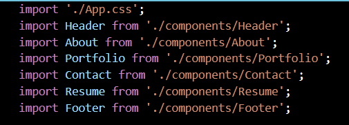
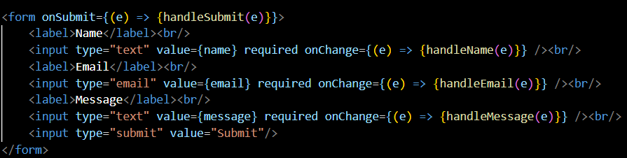

# react-portfolio

## Description
React-portfolio is a personal portfolio website, made with react, to show possible employers information on myself and how to contact me.

## Use
Must install express, react and extensions, bootstrap, webvitals.

## Code and Functionality
### Here is the code used to imoprt vall of my components:

### This code is how my form checks for input:

## Contact Infromation

[E-mail: Snyh121@gmail.com](mailto:snyh121@gmail.com)  
[GitHub: snyh212](https://github.com/snyh212)  
[LinkdIn: Shmuel-Hoffman](https://www.linkedin.com/in/shmuel-hoffman-254b0223b?lipi=urn%3Ali%3Apage%3Ad_flagship3_profile_view_base_contact_details%3BS2rg0PtBTLeG2szT2ZbGmg%3D%3D)